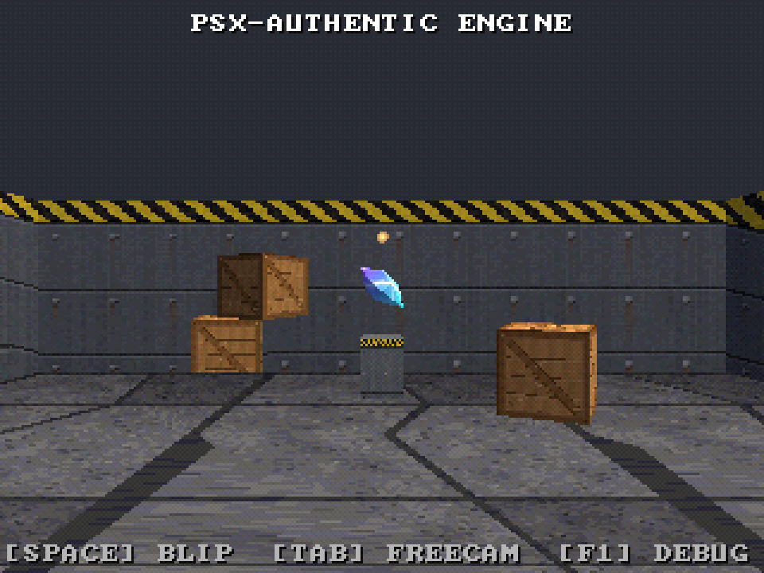
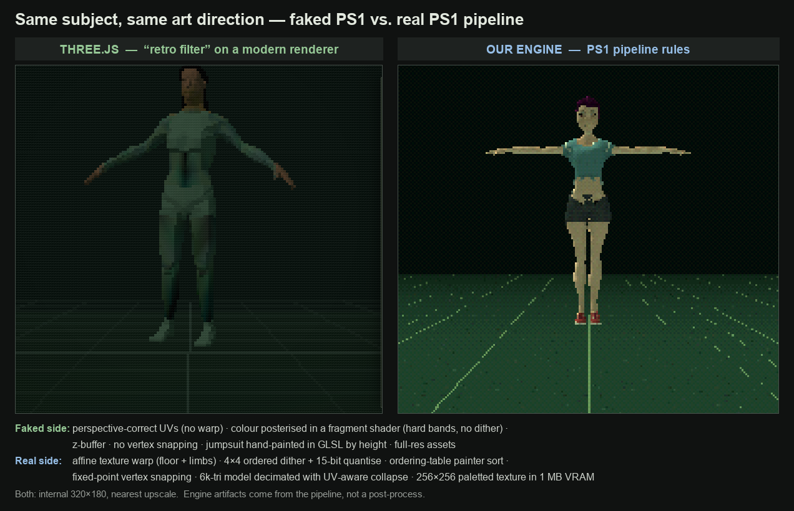

# PSX-Authentic x86 Game Engine

A native Windows x86-64 game engine that recreates the **rendering rules** of
PlayStation 1-era 3D — not a modern renderer with a retro post-process filter.
Every characteristic PS1 artifact here comes from the pipeline reproducing the
constraint that originally caused it.



## Philosophy

The engine renders into a low internal framebuffer (320×240 by default) using a
**software rasterizer**, then upscales to the window with nearest-neighbor
scaling. It reproduces the constraints, not a shader imitation of them:

- **Affine texture mapping** — UVs interpolate linearly in screen space, so
  large polygons visibly warp. No perspective correction by default.
- **No z-buffer** — primitives are sorted back-to-front through a 4096-bucket
  **ordering table** (painter's algorithm). Intersecting geometry mis-sorts,
  exactly as it did on hardware.
- **Fixed-point transforms** — a GTE-style 4.12 fixed-point transform stage
  with truncating multiplies and integer screen-space snapping. The "wobble"
  is precision loss, not animated noise.
- **Nearest-neighbor** texture sampling, **15-bit color** quantization, and the
  **PS1 ordered dither** matrix applied before the framebuffer write.
- **Simulated 1 MiB VRAM** (1024×512 halfwords) with 4/8-bit paletted (CLUT)
  and 15-bit textures, packed into texture pages under a hard 704 KiB budget.
- **Primitive-driven** renderer: meshes decompose into triangle/quad/sprite/
  line/tile packets before rasterization; quads split into two affine triangles.

Anything modern (perspective-correct UVs, bilinear filtering, a real z-buffer)
exists only as a **debug toggle** and is off by default.

## Requirements

- **MinGW-w64 g++** (tested with GCC 15.2, `x86_64-w64-mingw32`)
- **Python 3** with **Pillow** (asset pipeline)
- **SDL3** — bundled under `external/SDL3-3.4.12/` (windowing, input, audio, timing)

## Build & run

```powershell
# from the project root
.\build.ps1 -Assets -Run      # build assets + engine, then launch the demo
.\build.ps1                    # engine only (assets already built)
.\build.ps1 -Assets           # rebuild assets only path + engine
.\build.ps1 -Clean -Assets    # wipe build/ first
.\build.ps1 -Debug            # -O0 -g build
```

`build.ps1` compiles every `.cpp` under `engine/` and `game/src/` with g++,
links `SDL3`, and copies `SDL3.dll` next to the exe (`build/bin/psx_demo.exe`).

The asset pipeline (`tools/build_assets.py`) generates procedural source art,
converts it to engine-native binaries under `build/assets/`, and reports VRAM
and audio budget usage.

### Automation flags

```
psx_demo.exe --frames N          run N frames then exit (deterministic)
             --shots a,b,c        screenshot at those frame indices
             --debug P            start with overlay page P (0..3)
             --res W H            window size (default 960 720)
```

Screenshots land in `build/bin/screenshots/` as BMP (raw 320×240 + 3× upscaled).
`python tools/dev/convert_shots.py` converts them to PNG.

## Controls

Movement/gameplay (keyboard **or** XInput/PS-style pad):

| Action | Keyboard | Pad |
|---|---|---|
| Move | WASD / arrows / left stick | D-pad / left stick |
| Cross (action) | Space | South (A) — plays the blip SFX |
| Circle (cancel) | Backspace | East (B) |
| Square | Q | West (X) |
| Triangle | E | North (Y) |
| Turn camera | L1/R1 = `,` / `.` | shoulders |
| Start / Select | Enter / Left-Shift | Start / Back |

Debug (keyboard function keys — kept off the gameplay map):

| Key | Toggle |
|---|---|
| F1 | overlay page: off → stats → +OT histogram → +VRAM map |
| F2 | wireframe |
| F3 | dithering |
| F4 | color quantization |
| F5 | affine ⇄ perspective-correct texture mapping |
| F6 | z-buffer on/off |
| F7 | vertex snapping |
| F8 | nearest ⇄ bilinear filtering |
| F9 | draw-order visualization |
| F10 | cycle internal resolution (320×240 / 320×224 / 368×240 / 512×240 / 640×480) |
| F11 | cycle scale mode (integer / fit / stretch) |
| F12 | screenshot (raw + upscaled) |
| Tab | free camera (fly with WASD + R/F up/down, arrows look) |
| P / O | pause simulation / step one frame |
| Alt+Enter | fullscreen |

## Folder structure

```
engine/      core, math, platform (SDL3), renderer, audio, input, assets, debug
tools/       texture_importer, mesh_importer, palette_tool, level_packer,
             asset_manifest_builder, common (shared writers), build_assets.py
game/        src (demo + main), levels (source JSON)
source_assets/  procedurally generated textures/models/audio (gen_source_assets.py)
build/       assets (engine-native binaries) + bin (exe, dll, screenshots)
external/    bundled SDL3
docs/        file_formats.md, renderer_spec.md, asset_pipeline.md, coding_standards.md
```

## Authentic vs. faked PS1



The same low-poly character and art direction rendered two ways. **Left:** a
Three.js scene that fakes the PS1 look on a modern renderer — real low-res +
nearest textures, but perspective-correct UVs (textures never warp), colour
posterised in a fragment shader (hard bands, no dither), a z-buffer, and no
vertex snapping. **Right:** this engine, where the same artifacts fall out of
the pipeline itself — affine texture warp, 4×4 ordered dither + 15-bit
quantisation, ordering-table painter sorting, and fixed-point vertex snapping.

The character model used on the right is a third-party asset and is **not**
included in this repo; the comparison images are. To reproduce it, drop your own
model in `source_assets/` and add it via a `tools/assets_config.local.json`
overlay (gitignored) — see `tools/dev/decimate_tex.py` for the UV-aware
decimation step.

## Documentation

- [docs/renderer_spec.md](docs/renderer_spec.md) — how the renderer implements each PS1 rule
- [docs/asset_pipeline.md](docs/asset_pipeline.md) — the asset tools and how to add content
- [docs/file_formats.md](docs/file_formats.md) — engine-native binary format contract
- [docs/coding_standards.md](docs/coding_standards.md) — conventions for engine code
